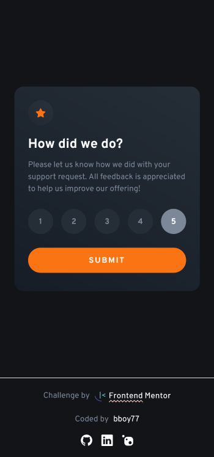
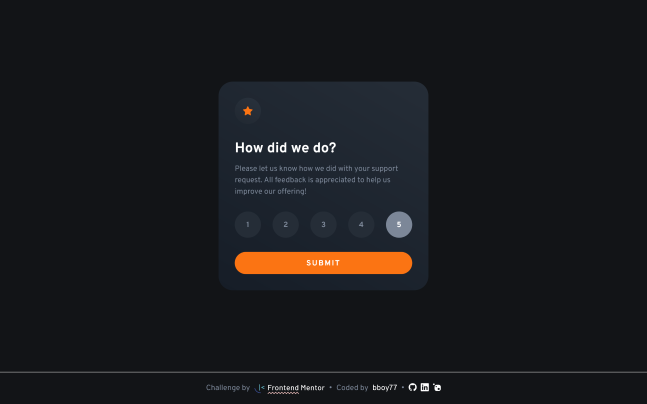

<b>Frontend Mentor</b>
<h1>Interactive rating component solution</h1>

This is a solution to the [Interactive rating component challenge on Frontend Mentor](https://www.frontendmentor.io/challenges/interactive-rating-component-koxpeBUmI).

## Table of contents

- [Overview](#overview)
  - [Screenshots](#screenshots)
  - [Links](#links)
- [My process](#my-process)
  - [Built with](#built-with)
  - [What I learned](#what-i-learned)
  - [Useful resources](#useful-resources)
- [Author](#author)

## Overview

### Screenshots

- Mobile



- Desktop



### Links

- Solution URL: [Frontend Mentor Solution](https://www.frontendmentor.io/solutions/interactive-rating-component-scss-v-a17gjNPy)
- Live Site URL: [Interactive rating component](https://bboy77.github.io/interactive-rating-component/)

## My process

### Built with

- Semantic HTML5 markup
- CSS custom properties
- Flexbox
- Mobile-first workflow
- Javascript
- SCSS

### Enhancements

- Initial disabled state for submit button
- Custom footer with links to code and package repositories

### What I learned

- CSS property `aspect-ratio` to properly size svg images based on the original size, using just the height or width.
- CSS value `currentColor` for the svg fill property. 

```css
svg {
    aspect-ratio: 7 /1;
    fill: currentColor;
    height: 1.2rem;
}
```

### Useful resources

- [Sass Lang](https://sass-lang.com/) - This has documentation for the sass language.
- [CSS Tricks](https://css-tricks.com/) - This has up-to-date information, tips, and tricks for css.
- [Gulp](https://gulpjs.com/) - This is a toolkit to automate & enhance your workflow.

## Author

- Frontend Mentor - [@bboy77](https://www.frontendmentor.io/profile/bboy77/)
- LinkedIn - [Andy Bish](https://www.linkedin.com/in/andy-bish-61a1ab70/)
- NuGet - [bboy77 - AebSolutions.codeConvention.SolutionTemplates](https://www.nuget.org/packages/AebSolutions.CodeConvention.SolutionTemplates)
- dotnetnew.azurewebsites.net - [Code Convention Multi-Project Ex Application (cc-multiex)](https://dotnetnew.azurewebsites.net/template/AebSolutions.CodeConvention.SolutionTemplates/AebSolutions.CodeConvention.Solution.Ex.6.6)
